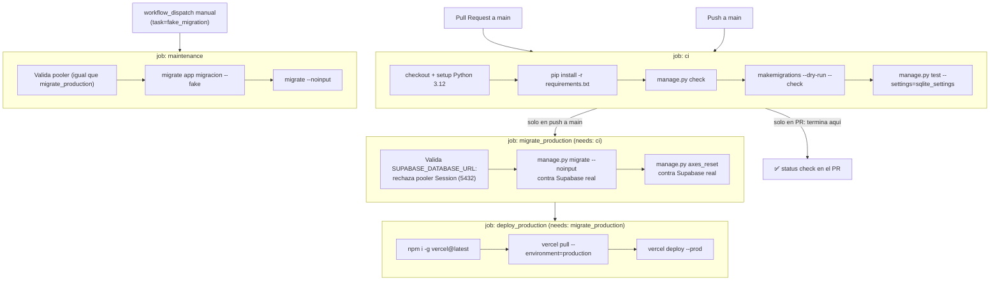

# Pipeline de despliegue — backend

Repo `nucleo-erp`. Todo el pipeline vive en un solo archivo: [.github/workflows/vercel.yml](../../.github/workflows/vercel.yml). Contingencia manual en [render.yaml](../../render.yaml) + [build.sh](../../build.sh), no automatizada.

## Diagrama

`concurrency: {group: production, cancel-in-progress: false}` — si dos push a `main` llegan cerca uno del otro, el segundo **espera en cola**, no cancela al primero. Evita que dos `migrate`/`deploy` corran a la vez contra la misma Supabase.

---

## 1. `ci` — corre en PR y en push a main

| Paso | Qué valida | Contra qué DB |
|---|---|---|
| `manage.py check` | system checks de Django | ninguna (no conecta) |
| `makemigrations --dry-run --check` | que no falten migraciones por generar | ninguna |
| `manage.py test --settings=sqlite_settings` | suite completa (446 tests: produccion, ventas, wms, compras, inventarios, finanzas, hr, nucleo) | SQLite en memoria — **nunca** Supabase |

Este último paso se agregó recientemente (antes solo corrían los dos primeros). En un PR, `ci` es el único job que corre — es el gate de revisión. En push a `main`, si `ci` falla, `migrate_production` y `deploy_production` ni siquiera arrancan (`needs: [ci]`).

## 2. `migrate_production` — solo en push a `main`, después de `ci`

Corre **contra Supabase real**, con `USE_REMOTE_DB=true`. Dos pasos:

1. **Valida el pooler**: parsea `SUPABASE_DATABASE_URL` y rechaza explícitamente el *Session pooler* (puerto 5432) — exige el *Transaction pooler* (6543). Es el mismo check que corre en `maintenance`, duplicado (no extraído a una action compartida).
2. `migrate --noinput` seguido de `axes_reset` (limpia bloqueos de fuerza bruta acumulados).

No hay paso de rollback si `migrate` deja el esquema a medias — depende de que las migraciones sean reversibles o de intervención manual vía `maintenance` (`--fake`).

## 3. `deploy_production` — solo si `migrate_production` tuvo éxito

`vercel deploy --prod` con el CLI de Vercel. Las variables de entorno del **runtime** desplegado (`SECRET_KEY`, `DATABASE_URL`, etc.) no las pasa este job — viven configuradas directamente en el proyecto de Vercel (dashboard), no en el workflow.

### Hallazgo: el entrypoint real no es el que documenta `CLAUDE.md`

`CLAUDE.md` dice "Entry is `api/index.py` → `ERP.wsgi.application`". Pero [vercel.json](../../vercel.json) declara `builds` explícito apuntando a `ERP/wsgi.py` directo (no a `api/index.py`), y cuando `vercel.json` trae `builds`, Vercel usa **solo** eso — ignora el auto-detect de la carpeta `/api`. `ERP/wsgi.py` ya expone `app` (alias de `application`) para que `@vercel/python` lo levante directo.

El `git log` de ambos archivos lo confirma: `api/index.py` no tiene commits después de `92c60e0` ("second try with vercel"), mientras `vercel.json` se siguió tocando después (`f697996 Fix Vercel deployment: Restore builds config...`) — el patrón de "zero-config vía `/api`" se abandonó a favor del `builds` explícito, y `api/index.py` quedó de código muerto sin que nadie lo borrara. Verificar contra el dashboard de Vercel antes de borrarlo (por si acaso se usa una función serverless separada para algo puntual), pero como entrypoint principal del sitio no está en la ruta activa.

## 4. `maintenance` — manual, `workflow_dispatch`

Único caso soportado hoy: `fake_migration` — aplica `manage.py migrate <app> <migracion> --fake` y luego `migrate --noinput`. Existe para cuando el estado de Supabase diverge del historial de migraciones (p. ej. alguien migró a mano, o una migración se aplicó parcialmente). Cualquier otro valor de `task` sale con `exit 1` explícito — no falla en silencio.

## 5. Post-deploy: `/healthz/`

`GET /healthz/` ([nucleo/api/api_views.py:225-229](../../nucleo/api/api_views.py)) — `AllowAny`, responde `{"ok": true}` sin tocar la base de datos. Confirma que el proceso WSGI levantó, **no** que Django puede hablar con Postgres. Nada en el pipeline lo llama automáticamente después del deploy; es un endpoint para monitoreo externo (uptime checks), no un gate del workflow.

## 6. Contingencia: Render

`render.yaml` + `build.sh`. Mismo código, **comportamiento de migración distinto**: `build.sh` corre `collectstatic` + `migrate` en cada build, a diferencia de Vercel donde migrar es un job de GitHub Actions separado del deploy. Si Render se activa como primario sin ajustar esto, las migraciones pasan a aplicarse en cada build en vez de coordinarse por el workflow — vale la pena tenerlo presente antes de un failover, no asumir que el comportamiento es idéntico solo porque el código es el mismo.

---

## Resumen de hallazgos

| Hallazgo | Severidad |
|---|---|
| `api/index.py` es código muerto — el entrypoint real es `ERP/wsgi.py` vía `vercel.json`, y `CLAUDE.md` documenta el que ya no aplica | baja, pero confunde a quien lea la doc |
| `/healthz/` no valida conexión a DB | media — un Supabase caído no lo detecta |
| Sin paso de rollback automatizado tras un deploy o migración fallida | media |
| Validación del pooler duplicada entre `migrate_production` y `maintenance` | baja, cosmético |
| Render (contingencia) migra en build-time, Vercel migra en un job aparte — comportamiento distinto bajo el mismo código | media si se activa Render sin ajustar expectativas |
