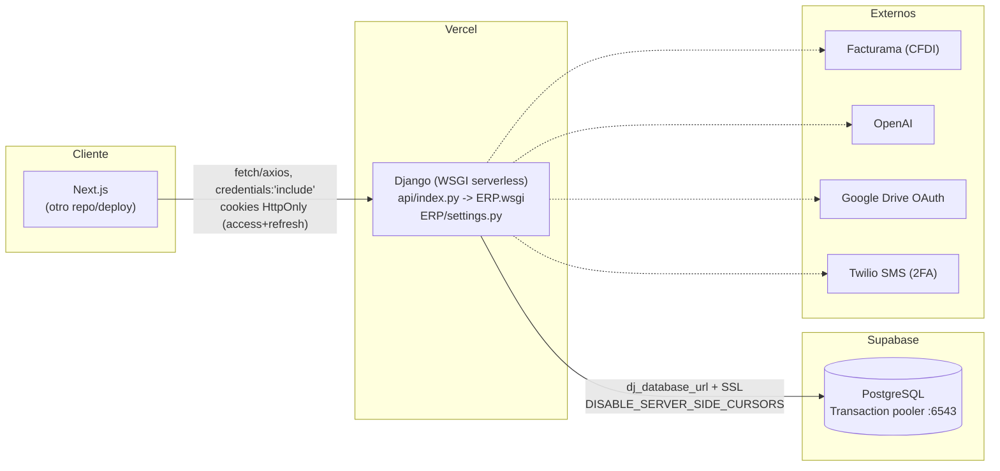
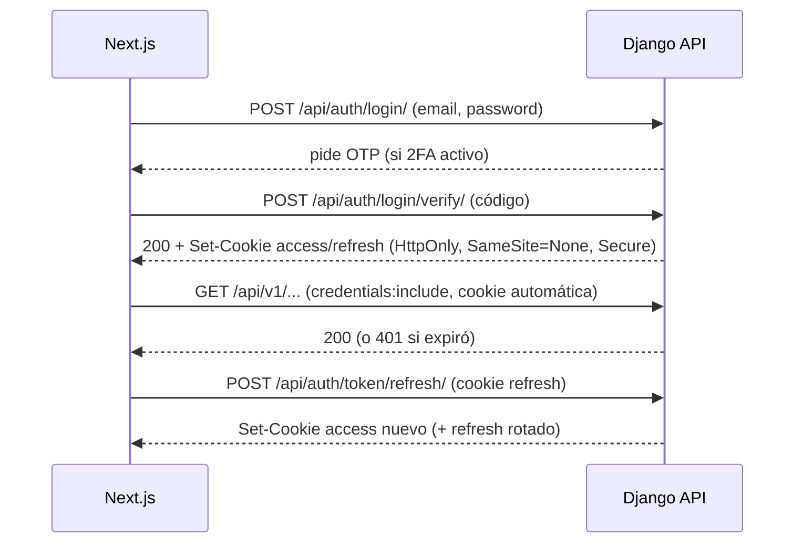

# Comunicación: Next.js → Django API → PostgreSQL

Repo backend: `nucleo-erp`. El frontend Next.js vive en otro repo (no auditado aquí) — esta doc cubre el contrato y la infraestructura del lado Django, con lo que Next.js debe respetar para hablar con la API.

## Diagrama de componentes



Alterno de contingencia: **Render** (`render.yaml`), gunicorn, sí corre `migrate` en `build.sh` — a diferencia de Vercel.

## Topología de despliegue

| Componente | Host | Notas |
|---|---|---|
| Next.js | deploy propio (repo separado) | no cubierto aquí |
| Django | Vercel serverless (WSGI) | entry `api/index.py` → `ERP.wsgi.application`; `vercel.json` enruta todo (`/(.*)`) a `ERP/wsgi.py`; migraciones **no** corren en deploy |
| Migraciones producción | GitHub Actions (`vercel.yml`, job `migrate_production`) | al hacer push a `main`, contra Supabase, después del deploy checks |
| Postgres | Supabase | **transaction pooler, puerto 6543** — el workflow de CI rechaza explícitamente el session pooler (5432) |
| Postgres local (dev) | `LOCAL_POSTGRES_*` | `USE_REMOTE_DB=False` |

---

## 1. Autenticación

JWT en cookie HttpOnly, vía `auth_kit` + MFA. `AUTH_KIT.USE_MFA=True` ([ERP/settings.py:89-94](../ERP/settings.py)).

**Endpoints** (`/api/auth/`, `auth_kit.urls` + `auth_kit.mfa.urls`):

| Endpoint | Método | Uso |
|---|---|---|
| `/api/auth/login/` | POST | 1er paso — credenciales; si el usuario tiene 2FA, responde pidiendo verificación |
| `/api/auth/login/verify/` | POST | 2do paso — código OTP; aquí se setean las cookies JWT |
| `/api/auth/login/resend/`, `/login/change-method/` | POST | reenviar código / cambiar método (email/SMS) |
| `/api/auth/token/refresh/` | POST | renueva access token desde la cookie refresh |
| `/api/auth/token/verify/` | POST | valida un token |
| `/api/auth/logout/` | POST | invalida cookies |
| `/api/auth/user/` | GET | usuario autenticado actual |
| `/api/auth/mfa/` | CRUD | métodos MFA del usuario |

**Cookies**: `AUTH_COOKIE_SAMESITE=None`, `AUTH_COOKIE_SECURE=True` en producción ([:92-93](../ERP/settings.py)) — obliga a Next.js a llamar con `credentials: 'include'` y a que ambos estén en HTTPS.

**Sesión deslizante**: `ACCESS_TOKEN_LIFETIME=15min`, `REFRESH_TOKEN_LIFETIME=1 día`, `ROTATE_REFRESH_TOKENS=True` — cada refresh emite un refresh token nuevo con ventana completa ([ERP/settings.py:99-111](../ERP/settings.py)). **`BLACKLIST_AFTER_ROTATION=False` a propósito**: no hay revocación real de tokens todavía (requeriría la app `token_blacklist` + migraciones, pendiente).



### Anti-CSRF: validación de Origin

Como la cookie usa `SameSite=None`, cualquier página podría disparar requests autenticadas. Se cierra con `OriginEnforcedJWTCookieAuthentication` ([nucleo/authentication.py](../nucleo/authentication.py)), usada como `DEFAULT_AUTHENTICATION_CLASSES` ([ERP/settings.py:301-306](../ERP/settings.py)):

- GET/HEAD/OPTIONS o auth por header `Authorization`: sin validar.
- Escritura autenticada por cookie: exige header `Origin` presente y que matchee `CORS_ALLOWED_ORIGINS`/`CORS_ALLOWED_ORIGIN_REGEXES` (reutiliza el matcher de `django-cors-headers`, misma whitelist).

**Next.js debe correr en un dominio dentro de esa whitelist** para poder hacer POST/PATCH/DELETE autenticados.

---

## 2. CORS

`ERP/settings.py:328-343`:

- `CORS_ALLOW_ALL_ORIGINS=False`, `CORS_ALLOW_CREDENTIALS=True` (obligatorio para cookies cross-site).
- `CORS_ALLOWED_ORIGINS` por env var (default solo `localhost:3000`).
- `CORS_ALLOWED_ORIGIN_REGEXES`: cualquier `*.onrender.com` y `*.vercel.app` — **incluye previews de Vercel**, no solo producción. Amplio a propósito para no bloquear PRs de Next.js, pero es superficie extra.
- `CORS_URLS_REGEX = r'^/api/.*$'` — CORS solo aplica a `/api/`, no a las vistas HTML del Core (`/`, `/QA/`, etc.), que son same-origin por diseño.

---

## 3. Camino de un request autenticado

```
Next.js
  -> HTTPS request a /api/v1/{app}/... con cookie JWT
  -> MIDDLEWARE (orden real, ERP/settings.py:120-135):
       SecurityMiddleware -> WhiteNoise -> CorsMiddleware -> SessionMiddleware
       -> CommonMiddleware -> CsrfViewMiddleware -> AuthenticationMiddleware
       -> MessageMiddleware -> XFrameOptionsMiddleware -> AxesMiddleware
       -> APILoggingMiddleware -> NoCacheMiddleware -> AccountMiddleware
       -> HistoryRequestMiddleware
  -> DRF: OriginEnforcedJWTCookieAuthentication (valida cookie + Origin)
  -> IsAuthenticated (default global)
  -> ViewSet.get_queryset() -- scoping multi-tenant por empresa
  -> Serializer (validate/create/update)
  -> ORM -> PostgreSQL (Supabase, pooler transaccional)
  -> Response JSON
  <- NoCacheMiddleware agrega Cache-Control: no-store en toda respuesta /api/
  <- APILoggingMiddleware escribe logs/api.log (INFO 2xx, WARNING 4xx, ERROR 5xx)
```

`CsrfViewMiddleware` está en la cadena pero las vistas DRF son `csrf_exempt` por diseño de `APIView` — la protección real contra CSRF en `/api/` la da la validación de `Origin` (§1), no el CSRF token clásico de Django.

---

## 4. Conexión Django → PostgreSQL

`ERP/settings.py:174-252`. Selector: `USE_REMOTE_DB` (default `True` en Vercel/`ENVIRONMENT=production`, default `False` en local).

| | Remoto (Supabase) | Local |
|---|---|---|
| Engine | `dj_database_url.parse(DATABASE_URL / SUPABASE_DATABASE_URL, ssl_require=True)` | `django.db.backends.postgresql` directo |
| `CONN_MAX_AGE` | **0 en Vercel/producción** (conexión nueva por invocación serverless), 600 si es remoto pero no serverless | por defecto de Django |
| `DISABLE_SERVER_SIDE_CURSORS` | `True` — **requerido**, el pooler transaccional de Supabase no soporta cursors server-side entre statements | `True` también, por consistencia |
| Puerto | **6543 (transaction pooler)** — el workflow de CI rechaza 5432 (session pooler) | 5432 |
| SSL | `sslmode=require` | configurable, `disable` por default |

`CONN_MAX_AGE=0` en serverless es intencional: cada invocación de función Vercel es efectivamente un proceso nuevo, mantener conexiones vivas no ayuda y el pooler ya administra el pool real hacia Postgres.

---

## 5. Riesgos / deuda técnica de esta capa

1. **Sin revocación real de JWT** (`BLACKLIST_AFTER_ROTATION=False`) — un token robado sigue vivo hasta expirar (15 min access, hasta 1 día si se sigue refrescando).
2. **CORS regex acepta cualquier preview `*.vercel.app`/`*.onrender.com`**, no solo el dominio de producción de Next.js — superficie amplia a propósito, vale la pena revisarla si se detecta abuso.
3. **Migraciones no corren en el deploy de Vercel** — un cambio de modelo no está en Supabase hasta que el job `migrate_production` de GitHub Actions corre en push a `main`. Ventana donde el código nuevo puede desincronizarse del esquema.
4. **`CsrfViewMiddleware` sigue en la cadena pero no protege `/api/`** (exento por `APIView`) — la protección real es Origin-check; fácil de asumir lo contrario si alguien lee solo `MIDDLEWARE`.
